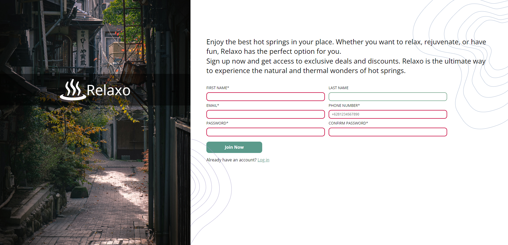
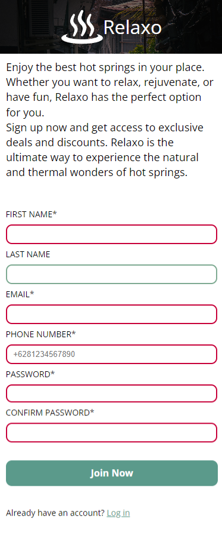

# Sign-Up Form Project

This project is part of The Odin Project's curriculum. The goal was to create a sign-up form using HTML and CSS.

## Features

- Responsive design for various screen sizes.
- Basic form validation for input fields.
- Stylish layout and user-friendly design.

## Demo

Here is a live demo of the sign-up form: [Demo Link](https://relaxo-site.netlify.app/)

## Getting Started

To run this project locally, follow these steps:

1. Clone this repository: `git clone https://github.com/your-username/sign-up-form.git`
2. Navigate to the project directory: `cd sign-up-form`
3. Open `index.html` in your web browser.

## Project Structure

The project directory is organized as follows:
/
├── index.html
├── css/
│ └── style.css
├── images/
│ └── background.jpg
└── README.md

## Technologies Used

- HTML
- CSS

## Contributing

Contributions are welcome! Feel free to fork and create a pull request.

## License

This project is licensed under the MIT License - see the [LICENSE](LICENSE) file for details.
